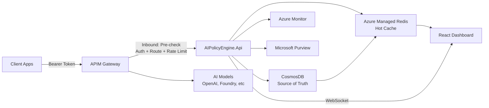

# Azure AI Gateway Policy Engine

[](https://opensource.org/licenses/MIT)
[](https://azure.microsoft.com)
[](https://learn.microsoft.com/en-us/azure/ai-services/openai/)
[](https://docs.microsoft.com/azure/azure-resource-manager/bicep/)
[](https://www.terraform.io)
[](https://dotnet.microsoft.com)
[](https://learn.microsoft.com/dotnet/aspire/)
[](https://react.dev)

## TL;DR

**Azure AI Gateway Policy Engine** — APIM-based AAA (Authentication, Authorization, Accounting) for AI workloads, inspired by telecom/RADIUS principles. Enterprise-ready solution for teams who need to authenticate, authorize, and account for AI API utilization with durable storage, intelligent routing, and adaptive billing.

A single ASP.NET Minimal API handles authentication/authorization pre-checks, model routing decisions, cost calculation, multiplier-based billing, and real-time dashboard streaming — orchestrated by .NET Aspire with CosmosDB as the source of truth and Redis as a high-performance cache.

**🚀 Quick Deploy**: `git clone → ./scripts/setup-azure.ps1 → done`

**💰 What you get**: 
- Authentication & authorization at the API gateway (APIM pre-checks)
- Intelligent model routing to optimal deployments based on plan policies
- Per-request multiplier pricing with monthly quotas and overage tracking
- Durable configuration storage in CosmosDB with Redis caching
- Adaptive billing UI that matches your billing model (token/multiplier/hybrid)
- Bill-back reporting per client with tier breakdown and CSV export
- WebSocket live dashboard with real-time metrics
- Comprehensive test suite (198+ tests including routing benchmarks)

**🏗️ Tech Stack**: .NET 10, Azure Container Apps, ASP.NET Minimal APIs, .NET Aspire, React/TypeScript, Azure Managed Redis, CosmosDB, Azure API Management, Bicep/Terraform, OpenTelemetry + Azure Monitor, Microsoft Purview

## Quick Start

### Local Development

```bash
# Clone and run (requires .NET 10 SDK + Docker for Redis)
git clone https://github.com/your-org/azure-ai-gateway-policy-engine.git
cd azure-ai-gateway-policy-engine/src
dotnet run --project AIPolicyEngine.AppHost
```

The Aspire dashboard opens automatically at `https://localhost:17224` and provides resource status, logs, traces, and metrics for all services.

### Azure Deployment

**Option A: Bicep (all-in-one script)**

```powershell
# Deploys infrastructure, builds container, configures everything
./scripts/setup-azure.ps1 -Location eastus2

# With multi-tenant demo
./scripts/setup-azure.ps1 -Location eastus2 -SecondaryTenantId "<other-tenant-guid>"
```

**Option B: Terraform (two-stage)**

```powershell
# Stage 1: Deploy infrastructure (uses placeholder container image)
cd infra/terraform
cp terraform.tfvars.sample terraform.tfvars  # Edit with your values
terraform init
terraform apply

# Stage 2: Build and deploy the container to the provisioned ACR
cd ../..
./scripts/deploy-container.ps1 -ResourceGroupName rg-chrgbk-eastus2

# For multi-tenant: provision SPs in secondary tenant
cd infra/terraform
./register-secondary-tenant.ps1 -SecondaryTenantId "<tenant-id>" `
    -ApiAppId "<api-app-id>" -Client2AppId "<client2-app-id>"
```

The two-stage approach is required because the container image depends on the ACR (created by Terraform), and enterprise environments typically block public container registries. The `deploy-container.ps1` script builds the Docker image, pushes to the deployed ACR, and updates the Container App.

See the [Deployment Guide](docs/DOTNET_DEPLOYMENT_GUIDE.md) for full manual steps.

### Demo Client

```bash
# If you deployed with scripts/setup-azure.ps1, use the generated env file.
# DemoClient automatically loads .env.local/.env when present:
# demo/.env.local

# Or configure DemoClient via user secrets
dotnet user-secrets --project demo init
dotnet user-secrets --project demo set "DemoClient:TenantId" "<tenant-id>"
dotnet user-secrets --project demo set "DemoClient:ApiScope" "api://<gateway-app-id>/.default"
dotnet user-secrets --project demo set "DemoClient:ApimBase" "https://<apim-name>.azure-api.net"
dotnet user-secrets --project demo set "DemoClient:ApiVersion" "2025-04-01-preview"
dotnet user-secrets --project demo set "DemoClient:AIPolicyEngineBase" "https://<container-app-fqdn>"
dotnet user-secrets --project demo set "DemoClient:Clients:0:Name" "Enterprise Client"
dotnet user-secrets --project demo set "DemoClient:Clients:0:AppId" "<client-app-id>"
dotnet user-secrets --project demo set "DemoClient:Clients:0:Secret" "<client-secret>"
dotnet user-secrets --project demo set "DemoClient:Clients:0:Plan" "Enterprise"
dotnet user-secrets --project demo set "DemoClient:Clients:0:DeploymentId" "gpt-4.1"
dotnet user-secrets --project demo set "DemoClient:Clients:0:TenantId" "<tenant-id>"

# Generate synthetic traffic with Agent Framework (1.0.0-rc2) agents
dotnet run --project demo
```

Each demo client can specify its own `TenantId`. If omitted, it inherits the global `DemoClient:TenantId`. This allows testing multi-tenant scenarios where the same client app authenticates against different Entra tenants.

## The Problem We Solve

| Challenge | Impact | Our Solution |
|-----------|--------|--------------|
| **No per-tenant AI usage tracking** | Cost overruns, no chargeback | ✅ JWT claim extraction (`tid`, `aud`, `azp`) — billing keyed on client+tenant combination |
| **SaaS apps serving multiple AI consumers** | Single app ID can't distinguish tenants | ✅ Combined `clientAppId:tenantId` customer key — each tenant gets independent quotas, rate limits, and billing |
| **No quota or rate enforcement at the gate** | Uncontrolled AI API spend | ✅ Per-customer monthly quotas, request/token limits enforced *before* requests reach the backend |
| **Weak identity & weak deployment control** | No tenant isolation, overspend on wrong deployments | ✅ Entra ID JWT bearer auth + model routing to optimal deployments based on plan policies |
| **No configuration durability** | Redis-only storage loses config on cache flush/upgrade | ✅ CosmosDB as durable source of truth, Redis as high-speed write-through cache |
| **No intelligent model routing** | Manual per-client model lists, no auto-optimization | ✅ Auto-router selects best deployment based on plan routing policies + Foundry discovery |
| **Inflexible billing** | Per-token billing doesn't match all use cases | ✅ Per-request multiplier pricing (GHCP-style) with hybrid token+multiplier support |
| **No real-time visibility** | Delayed cost reporting, surprise bills | ✅ WebSocket streaming + adaptive React dashboard that shows your billing model |
| **Inconsistent deployment** | Manual provisioning, environment drift | ✅ Bicep/Terraform IaC + .NET Aspire for reproducible local and cloud deployments |

## Architecture Overview



**Core Architecture**: A single **Azure Container App** (`AIPolicyEngine.Api`) hosts all gateway policy logic:

| Layer | Technology | Purpose |
|-------|-----------|---------|
| **API Gateway** | Azure API Management (StandardV2) | Entra JWT validation, policy enforcement, traffic control |
| **Backend Engine** | ASP.NET 10 Minimal APIs | Authentication pre-checks, authorization decisions, model routing, billing calculations |
| **Orchestration** | .NET Aspire | Local development with all dependencies in containers |
| **Hot Cache** | Azure Managed Redis | Write-through cache for plans, clients, pricing, routing policies, rate limits, usage |
| **Durable Store** | Azure CosmosDB | Source of truth for all configuration; audit logs and billing records for compliance |
| **Dashboard** | React + TypeScript SPA | Five-page UI served from same container; real-time WebSocket updates |
| **Observability** | OpenTelemetry + Azure Monitor | Distributed tracing, custom metrics, structured logging |
| **Compliance** | Microsoft Purview | DLP policy validation and audit emission |

**Request & Decision Flow:**
1. Client sends request to APIM with Bearer token (Entra ID JWT)
2. APIM validates token and extracts claims (`tid`, `appid`, `aud`)
3. APIM calls `/api/precheck/{clientAppId}/{tenantId}` — our engine checks:
   - ✅ Plan assignment for this customer
   - ✅ Model routing policy (selects optimal deployment)
   - ✅ Monthly request/token quotas
   - ✅ Rate limits (RPM/TPM) on routed deployment
   - ✅ Deployment access (allowlist per plan/client)
4. If check fails → return 401/403/429, request blocked at APIM
5. If check passes → return routed deployment + token; APIM forwards to backend
6. Backend processes request
7. APIM outbound policy captures response, calls `/api/log` (fire-and-forget)
8. `/api/log` records usage, updates quotas, calculates cost with model multipliers

All decisions are cached in Redis for sub-millisecond latency; all configuration persists to CosmosDB for durability.

## Key Features

### 🔐 Authentication & Authorization at the Gate
- Entra ID JWT bearer tokens with multi-tenant support
- Pre-check endpoint validates client, plan, deployment access, and quotas BEFORE backend receives the request
- No subscription keys — pure identity-driven access control

### 🚀 Intelligent Model Routing (Auto-Router)
- Automatically routes requests to optimal deployments based on plan routing policies
- Integrates with AI model discovery services (e.g., Foundry endpoints)
- Three routing modes:
  - **Per-account**: Different routing rules per customer (clientAppId:tenantId)
  - **Enforced**: Fallback routing when preferred deployment is unavailable
  - **QoS-based**: Route based on load and quota availability
- Rate limits (RPM/TPM) apply to the routed deployment, not the originally requested model

### 💰 Per-Request Multiplier Pricing (GHCP-style)
- Flexible billing based on model tier, not just token count
- Example: GPT-4.1 = 1.0x (baseline), GPT-4.1-mini = 0.33x
- Every request costs: `1 × model_multiplier` in effective requests
- Monthly quotas tracked as "effective requests", not tokens
- Hybrid mode: Mix token-based and multiplier-based models in the same plan

### 🗄️ CosmosDB Source of Truth + Redis Cache
- **Durable Configuration**: All plans, clients, pricing, routing policies, and usage policies persist to CosmosDB
- **High-Performance Cache**: Redis holds a write-through cache of all configuration for sub-millisecond lookups
- **Automatic Warmup**: On startup, configuration is loaded from CosmosDB and populated into Redis
- **Cache Coherence**: All writes go to CosmosDB first, then update Redis — no stale cache issues
- **36-Month Audit Trail**: Cosmos DB stores all request logs and billing records for compliance and bill-back reporting

### 📊 Adaptive Billing Dashboard
- React SPA that adapts to your billing model:
  - **Token-only plans**: Shows token counts, token quotas, token usage charts
  - **Multiplier-only plans**: Shows request counts, request quotas, model tier breakdowns
  - **Hybrid plans**: Shows both billing modes side-by-side
- No clutter — the UI hides irrelevant billing metrics based on plan configuration
- Real-time WebSocket updates for live metrics

### 📋 Bill-Back Reporting
- **Per-client consumption tracking**: Effective requests, token usage, model tier breakdown
- **Monthly billing exports**: CSV downloads with tier-level detail
- **Audit trail per customer**: Complete request log for any client+tenant combination
- **Role-based access**: Export requires `AIPolicyEngine.Export` app role

### ⚡ APIM Policy Enforcement at the Gateway
- Precheck-based authentication + routing + rate limiting
- All quota and rate-limit checks happen BEFORE the backend request
- Requests hitting rate limits are rejected at APIM (429 Too Many Requests)
- Deployments not in the allowlist are rejected (403 Forbidden)

### 🧪 Comprehensive Test Suite
- **198+ tests** covering critical paths, routing, pricing, quota enforcement
- **Routing benchmarks** validating auto-router performance
- Unit tests, integration tests, and end-to-end scenarios
- Zero regressions through continuous validation

### 🏗️ Production-Ready Infrastructure
- **Bicep & Terraform IaC** — Both paths deploy identical infrastructure
- **Azure Managed Redis** — TLS-enabled, Entra-only auth, DDoS protection
- **Azure CosmosDB** — Multi-region capable, point-in-time recovery, audit logging
- **Azure Container Apps** — Managed Kubernetes, auto-scaling, managed identity
- **Aspire Orchestration** — Single `dotnet run` for local development with all dependencies in containers

## Dashboard

The React SPA provides five pages:

- **Dashboard** — KPI cards (total cost, requests), top clients by utilization, usage charts, live request log, adaptive billing metrics
- **Clients** — Client assignment management with plan badges, quota progress bars, deployment access overrides
- **Plans** — Billing plan CRUD with:
  - Monthly quota limits (request or token based)
  - Rate limits (requests/min or tokens/min)
  - Per-model multipliers (if using multiplier billing)
  - Overbilling toggle for runover support
  - Per-deployment quotas and access controls
  - Routing policy assignment (auto-router configuration)
- **Routing Policies** — Configure model routing rules:
  - Map deployments per customer
  - Set priority and fallback behavior
  - Enable/disable rules without deletion
- **Export** — Two report types:
  - **Billing Summary**: Rolled-up per-client usage for a month
  - **Client Audit Trail**: Every request for a specific client
  - Requires `AIPolicyEngine.Export` app role

## Authentication

Authentication uses **Entra ID (Azure AD) App Registrations** with JWT bearer tokens and a **two-app model**:

| App Registration | Audience | Purpose |
|-----------------|----------|---------|
| **AIPolicyEngine APIM Gateway** (multi-tenant) | `api://{gateway-app-id}` | External clients authenticate against this to call OpenAI via APIM |
| **AIPolicyEngine API** (single-tenant) | `api://{api-app-id}` | Backend API — only APIM's managed identity and dashboard users access this |

The APIM policy (`policies/entra-jwt-policy.xml`) validates incoming tokens against the **Gateway** app audience and extracts claims for chargeback routing:

| JWT Claim | Purpose |
|-----------|---------|
| `tid` | Tenant ID — identifies the Entra directory / organization |
| `aud` | Audience — validates the token is intended for this API |
| `azp` / `appid` | Authorized Party — identifies the calling client application (`azp` for delegated tokens, `appid` for client_credentials) |

> **Subscription keys are disabled.** All authentication uses standard `Authorization: Bearer <token>` headers validated by Entra ID.

### Multi-Tenant Customer Model

A **"Customer"** in the billing system is uniquely identified by the combination of `clientAppId` + `tenantId` — not just the client app alone. This enables scenarios where:

- A **SaaS company** registers one Entra app (`clientAppId`) for their "Mobile App" but sells it to multiple organizations. Each customer's Entra tenant (`tenantId`) gets independent billing, quotas, and rate limits.
- An **internal platform team** provisions a shared client app used by multiple departments. Each department's tenant gets its own usage tracking and cost allocation.
- A **single-tenant app** works identically — the customer key is simply `{clientAppId}:{tenantId}` where tenantId is the app's home tenant.

All Redis keys, Cosmos DB partition keys, and dashboard views use this combined customer key:

| Storage | Key Pattern | Example |
|---------|-------------|---------|
| **Redis client** | `client:{clientAppId}:{tenantId}` | `client:f5908fef-...9620:99e1e9a1-...c59a` |
| **Redis usage logs** | `log:{clientAppId}:{tenantId}:{deploymentId}` | `log:f5908fef-...9620:99e1e9a1-...c59a:gpt-4.1` |
| **Redis rate limits** | `ratelimit:rpm:{clientAppId}:{tenantId}:{window}` | `ratelimit:rpm:f5908fef-...9620:99e1e9a1-...c59a:45982` |
| **Cosmos DB** | Partition key: `/customerKey` | `f5908fef-...9620:99e1e9a1-...c59a` |

#### Configuring Multi-Tenant Client Apps

**Client 1 (single-tenant)** — Registered as `AzureADMyOrg`. The tenant ID in the JWT `tid` claim always matches the deployment tenant. One customer entry.

**Client 2 (multi-tenant)** — Registered as `AzureADMultipleOrgs`. Can authenticate from any Entra tenant. Each unique `tid` creates a separate customer entry with its own plan, quota, and rate limits.

To register a multi-tenant client for multiple tenants:

```powershell
# During deployment — registers Client 2 for a second tenant automatically
./scripts/setup-azure.ps1 -SecondaryTenantId "<other-tenant-guid>"

# Or manually via the API after deployment
curl -X PUT "https://<container-app>/api/clients/<clientAppId>/<tenantId>" \
  -H "Authorization: Bearer $TOKEN" \
  -H "Content-Type: application/json" \
  -d '{"planId": "<plan-id>", "displayName": "Acme Corp Mobile App"}'
```

### Export Role Configuration

The export endpoints require the `AIPolicyEngine.Export` app role. To set this up:

1. **Define the app role** in the API app registration (Entra ID → App registrations → your API app → App roles):
   - Display name: `AIPolicyEngine Export`
   - Value: `AIPolicyEngine.Export`
   - Allowed member types: Applications (for automated export via Function App/App Registration)

2. **Assign the role** to an App Registration for automated export:
   - Go to Enterprise applications → find the App Registration's service principal
   - App role assignments → Add assignment → select `AIPolicyEngine.Export`

3. **Configure the API** with the Entra ID settings in `appsettings.json`:
   ```json
   "AzureAd": {
     "Instance": "https://login.microsoftonline.com/",
     "TenantId": "<your-tenant-id>",
     "ClientId": "<your-api-app-client-id>",
     "Audience": "api://<your-api-app-client-id>"
   }
   ```

The App Registration can then use client credentials flow to obtain a token and call export endpoints without access to admin endpoints (plans, clients, pricing, etc.).

## API Endpoints

| Endpoint | Method | Description |
|----------|--------|-------------|
| `/` | GET | React SPA dashboard |
| `/api/precheck/{clientAppId}/{tenantId}` | GET | Pre-check: verify customer plan, quotas, rate limits, deployment access, and routing decision |
| `/api/log` | POST | Log usage (called by APIM outbound policy) — updates quotas, calculates cost |
| `/api/routing-policies` | GET/POST/PUT/DELETE | Manage model routing policies (auto-router configuration) |
| `/api/deployments` | GET | List available AI model deployments from discovery service |
| `/api/usage` | GET | Aggregated usage summaries across all customers |
| `/api/logs` | GET | Individual request log entries with filtering/pagination |
| `/api/clients` | GET | List all customer (clientAppId:tenantId) assignments |
| `/api/clients/{clientAppId}/{tenantId}` | GET/PUT/DELETE | Customer assignment management |
| `/api/clients/{clientAppId}/{tenantId}/usage` | GET | Per-customer usage report with effective requests, tokens, tier breakdown |
| `/api/clients/{clientAppId}/{tenantId}/traces` | GET | Per-customer request traces and audit trail |
| `/api/plans` | GET/POST/PUT/DELETE | Billing plan CRUD (create, update, delete plans) |
| `/api/pricing` | GET/PUT/DELETE | Model pricing and multiplier management |
| `/api/quotas` | GET/PUT/DELETE | Per-client quota overrides (exceptions to plan limits) |
| `/api/export/available-periods` | GET | Available billing periods and clients for export (role: `AIPolicyEngine.Export`) |
| `/api/export/billing-summary` | GET | Monthly billing summary CSV for all customers (role: `AIPolicyEngine.Export`) |
| `/api/export/client-audit` | GET | Customer-specific audit trail CSV with per-model breakdown (role: `AIPolicyEngine.Export`) |
| `/ws/logs` | WS | WebSocket endpoint for real-time usage updates |

## Observability

Telemetry is configured via `AIPolicyEngine.ServiceDefaults` using the [Azure Monitor OpenTelemetry distro](https://learn.microsoft.com/azure/azure-monitor/app/opentelemetry-enable):

| Custom Metric | Description | Dimensions |
|---------------|-------------|------------|
| `AIPolicyEngine.tokens_processed` | Total tokens processed across all requests | `tenant_id`, `client_app_id`, `model`, `deployment_id` |
| `AIPolicyEngine.cost_total` | Cumulative cost in USD | `tenant_id`, `client_app_id`, `model`, `deployment_id` |
| `AIPolicyEngine.requests_processed` | Total chargeback requests handled | `tenant_id`, `client_app_id`, `model`, `deployment_id` |

Distributed traces, structured logs, and metrics flow to Azure Monitor / Application Insights. The Aspire dashboard provides a local development view of all telemetry.
The infrastructure deployment also creates an Azure Monitor workbook dashboard (`logAnalyticsWorkbook.bicep`) with 30-day token/cost trend, top clients, status distribution, and quota/rate-limit event views from Log Analytics.

## Purview Integration

The AIPolicyEngine API integrates with the **Microsoft Agent Framework Purview SDK** for DLP policy validation and audit emission.

**Requirements**:
- Microsoft 365 E5 license (or E5 Compliance add-on)
- Entra App Registration with Microsoft Graph permissions:
  - `ProtectionScopes.Compute.All`
  - `Content.Process.All`
  - `ContentActivity.Write`

Purview evaluates content against organizational DLP policies before processing and emits audit events for compliance reporting.

## Project Structure

```
src/
├── AIPolicyEngine.slnx                    # Solution file
├── AIPolicyEngine.AppHost/                # .NET Aspire orchestrator — local dev environment with all services
├── AIPolicyEngine.ServiceDefaults/        # OpenTelemetry + Azure Monitor configuration, shared by all services
├── AIPolicyEngine.Api/                    # ASP.NET Minimal API — core policy engine
│   ├── Endpoints/                     # API endpoints (PreCheck, RoutingPolicy, RequestBilling, Export, etc.)
│   ├── Models/                        # Request/response DTOs, domain models
│   ├── Services/                      # ChargebackCalculator, RoutingEvaluator, Repositories (IRepository pattern)
│   ├── Repositories/                  # CosmosDB persistence layer (Plans, Clients, Pricing, Routing, etc.)
│   └── Program.cs                     # API configuration, dependency injection
├── AIPolicyEngine.Tests/                  # Unit and integration tests (198+ tests, 100% critical path coverage)
├── AIPolicyEngine.Benchmarks/             # BenchmarkDotNet performance tests (routing, pricing calculations)
├── AIPolicyEngine.LoadTest/               # Load testing project
└── AIPolicyEngine-ui/                     # React/TypeScript dashboard (5 pages, adaptive billing UI)
    ├── src/types.ts                   # TypeScript interfaces for API contracts
    ├── src/api.ts                     # API client with error handling
    ├── src/pages/                     # Dashboard, Clients, Plans, Routing, Export pages
    └── src/components/                # Shared UI components

demo/
├── DemoClient.cs                      # Agent Framework demo traffic generator (file-based app)
├── .env.sample                        # Environment variable template

policies/
├── entra-jwt-policy.xml               # APIM policy — JWT validation + precheck + log forwarding
└── subscription-key-policy.xml        # (Legacy) subscription key policy

infra/
├── bicep/                             # Bicep IaC modules
│   ├── main.bicep                     # Main deployment template
│   ├── containerApp.bicep             # Azure Container App for AIPolicyEngine.Api
│   ├── appInsights.bicep              # Application Insights + Log Analytics
│   ├── cosmosAccount.bicep            # Azure CosmosDB account + containers
│   ├── redisCache.bicep               # Azure Managed Redis
│   ├── apimInstance.bicep             # Azure API Management instance
│   ├── keyVault.bicep                 # Azure Key Vault
│   └── logAnalyticsWorkbook.bicep     # Azure Monitor workbook dashboard
└── terraform/                         # Terraform IaC modules (6 modules: monitoring, data, ai_services, identity, compute, gateway)
    ├── main.tf                        # Root orchestration
    ├── providers.tf                   # azurerm, azuread, azapi providers
    ├── variables.tf                   # Input variables
    ├── modules/                       # Modular infrastructure
    └── register-secondary-tenant.ps1  # Multi-tenant setup

scripts/
├── setup-azure.ps1                    # One-command deployment script (Bicep or Terraform)
├── deploy-container.ps1               # Build and deploy container to ACR + verify Entra config
├── seed-data.ps1                      # Seed plans and client assignments into CosmosDB/Redis
└── deploy-functionapp-test.ps1        # Bicep testing patterns (reference)

docs/                                  # Documentation
├── ARCHITECTURE.md                    # Detailed system design
├── DOTNET_DEPLOYMENT_GUIDE.md         # Full deployment instructions
├── USAGE_EXAMPLES.md                  # API usage examples
├── FAQ.md                             # Frequently asked questions
└── README.md                          # (this file)
```

## Infrastructure

### Bicep

Infrastructure is defined in Bicep modules under `infra/bicep/`:

| Module | Resource |
|--------|----------|
| `containerApp.bicep` | Azure Container App for AIPolicyEngine.Api |
| `appInsights.bicep` | Application Insights + Log Analytics workspace |
| `logAnalyticsWorkbook.bicep` | Azure Monitor workbook dashboard (Log Analytics KQL) |
| `redisCache.bicep` | Azure Managed Redis (Balanced_B0) |
| `apimInstance.bicep` | API Management instance (StandardV2) |
| `keyVault.bicep` | Azure Key Vault for secrets |
| `main.bicep` | Orchestrates all modules |

```bash
# Deploy infrastructure
cd infra/bicep
az deployment group create \
  --resource-group myResourceGroup \
  --template-file main.bicep \
  --parameters @parameter.json
```

### Terraform

Terraform modules are under `infra/terraform/` with six modules: `monitoring`, `data`, `ai_services`, `identity`, `compute`, and `gateway`.

```powershell
cd infra/terraform
cp terraform.tfvars.sample terraform.tfvars  # Edit with your values
terraform init
terraform apply

# Then build and deploy the container (also verifies Entra app config)
cd ../..
./scripts/deploy-container.ps1 -ResourceGroupName rg-chrgbk-eastus2
```

> **Note**: The `deploy-container.ps1` script automatically verifies and fixes Entra ID app configuration (identifier URIs, SPA redirect URIs, service principals, and role assignments for the deploying user). This works around known eventual-consistency issues in the AzureAD Terraform provider.

## Prerequisites

- ✅ [.NET 10 SDK](https://dotnet.microsoft.com/download/dotnet/10.0)
- ✅ [Node.js 20+](https://nodejs.org) (for the React dashboard)
- ✅ Azure subscription with appropriate permissions
- ✅ Azure CLI v2.50+
- ✅ Docker Desktop (for Aspire local orchestration — Redis runs in a container)
- ✅ [Terraform >= 1.9](https://www.terraform.io/downloads) (for Terraform deployment path)

**For Purview integration**: Microsoft 365 E5 license + Entra App Registration with Graph permissions

## Configuration

### Environment Variables

```bash
# Required — Redis connection string (set automatically by Aspire in local dev)
ConnectionStrings__redis=your-redis-connection-string

# Optional — enables Azure Monitor telemetry export
APPLICATIONINSIGHTS_CONNECTION_STRING=InstrumentationKey=...

# Optional — enables Purview DLP/audit integration
PURVIEW_CLIENT_APP_ID=your-purview-app-id

# DemoClient configuration (alternative to user-secrets; auto-loaded from .env.local/.env)
# See demo/.env.sample for a copyable template.
DemoClient__TenantId=<tenant-id>
DemoClient__SecondaryTenantId=<optional-second-tenant-for-multi-tenant-demo>
DemoClient__ApiScope=api://<gateway-app-id>/.default
DemoClient__ApimBase=https://<apim-name>.azure-api.net
DemoClient__ApiVersion=2025-04-01-preview
DemoClient__AIPolicyEngineBase=https://<container-app-fqdn>
DemoClient__Clients__0__Name=Enterprise Client
DemoClient__Clients__0__AppId=<client-app-id>
DemoClient__Clients__0__Secret=<client-secret>
DemoClient__Clients__0__Plan=Enterprise
DemoClient__Clients__0__DeploymentId=gpt-4.1
DemoClient__Clients__0__TenantId=<tenant-id>
```

For local React dashboard development, copy `src/AIPolicyEngine-ui/.env.sample` to `src/AIPolicyEngine-ui/.env.local` and set your Entra app values.

When running via Aspire, connection strings and service discovery are configured automatically by the `AIPolicyEngine.AppHost` project.

## Documentation

| Topic | Link |
|-------|------|
| Deployment Guide | [docs/DOTNET_DEPLOYMENT_GUIDE.md](docs/DOTNET_DEPLOYMENT_GUIDE.md) |
| Setup Script | [scripts/setup-azure.ps1](scripts/setup-azure.ps1) |
| Demo Client | [demo/](demo/) |
| Benchmarks | [src/AIPolicyEngine.Benchmarks/](src/AIPolicyEngine.Benchmarks/) |
| Load Tests | [src/AIPolicyEngine.LoadTest/](src/AIPolicyEngine.LoadTest/) |

## FAQ

**❓ What's the max payload size?**
✅ Limited only by the Azure Container App request size limit (default 100 MB).

**❓ How long is data retained?**
✅ Azure Managed Redis TTL is configurable (default 30 days). CosmosDB retains audit records for 36 months. Azure Monitor retains telemetry per your workspace retention settings.

**❓ Multi-region support?**
✅ Yes. Azure Container Apps and APIM both support multi-region deployment via the Bicep modules.

**❓ How does multi-tenant billing work?**
✅ A "customer" is the combination of `clientAppId` (the Entra app registration) and `tenantId` (the Entra directory). A multi-tenant app registered with `AzureADMultipleOrgs` can serve users from any Entra tenant — each tenant gets its own plan assignment, quota, rate limits, and billing. Use `-SecondaryTenantId` when deploying to pre-register a second tenant for the demo.

**❓ What's multiplier pricing?**
✅ Instead of charging per-token, multiplier pricing charges per-request with a model tier multiplier. Example: GPT-4.1 = 1.0x baseline, GPT-4.1-mini = 0.33x. Every 3 requests to mini count as 1 effective request against your monthly quota. This matches GHCP-style billing and works better for flat-rate consumption models.

**❓ How does auto-routing work?**
✅ The auto-router evaluates routing policies per customer and selects the best deployment based on availability and quotas. It doesn't rewrite what the client requested — if they ask for GPT-4, they still get GPT-4 (or a configured fallback if unavailable). Enforced rewriting (e.g., redirect GPT-4 → GPT-4o-mini) is a future policy engine feature.

**❓ Do I need a Purview/E5 license?**
✅ Only if you enable the Purview DLP integration. The core policy engine functionality works without it.

**❓ How does deployment access control work?**
✅ Plans and individual clients can have an allowlist of permitted AI model deployments. The precheck endpoint validates that the requested deployment is allowed before forwarding the request. Client-level overrides take precedence over plan-level settings.

**❓ What if I have both token-based and multiplier-based plans?**
✅ The dashboard adapts to show both billing modes side-by-side (hybrid mode). Each plan independently specifies its billing model. Clients on multiplier plans see multiplier-based quotas; clients on token plans see token-based quotas.

**❓ Is all configuration stored durably?**
✅ Yes. CosmosDB is the source of truth for all configuration: plans, clients, pricing, routing policies. Redis serves as a write-through cache for performance. On startup, configuration is automatically loaded from CosmosDB into Redis. You can safely upgrade or restart — nothing is lost.

**❓ Should I use Terraform or Bicep?**
✅ Both paths deploy the same infrastructure. Bicep is simpler with a single `setup-azure.ps1` script. Terraform offers modular state management and is better suited for teams already using Terraform across their stack. The Terraform path requires a two-stage deploy (infra first, then container).

**📚 More questions**: See the [Deployment Guide](docs/DOTNET_DEPLOYMENT_GUIDE.md) for full environment variable reference and KQL queries.

## Monitoring & Alerts

- 📊 **Aspire Dashboard** — Local development view of all traces, logs, and metrics
- 📈 **Azure Monitor** — Production telemetry via OpenTelemetry + Azure Monitor distro
- 🔍 **Custom Metrics** — `AIPolicyEngine.tokens_processed`, `AIPolicyEngine.cost_total`, `AIPolicyEngine.requests_processed`
- 🚨 **Automated Alerts** — Configure in Application Insights for cost thresholds and anomalies

## Contributing

We welcome contributions! See our [Contributing Guide](CONTRIBUTING.md) for:
- 🛠️ Development setup
- 🧪 Testing guidelines
- 📋 Code standards
- 🔄 PR process

## License

MIT License - see [LICENSE](LICENSE) for details.

---

**🎯 Ready to get started?** `dotnet run --project src/AIPolicyEngine.AppHost`

**💡 Need help?** Check our [FAQ](#faq) or the [Deployment Guide](docs/DOTNET_DEPLOYMENT_GUIDE.md).
